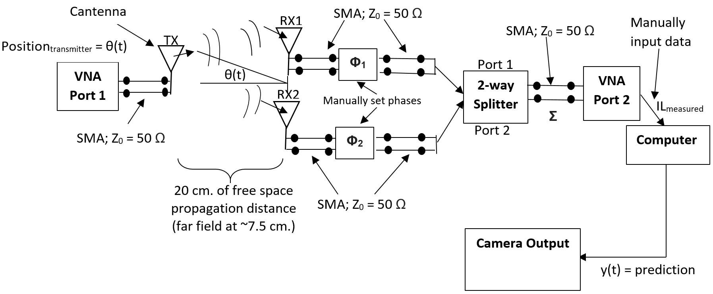

# Electromagnetic Transmitter Position Estimation
This repository contains our final project for MIT's 6.013: Electromagnetics and Applications course.  For this project, we built a dipole antenna receiver system that estimates the angle of a far-field electromagnetic transmitter with respect to the receiver.

A diagram of our system is provided below:

To see our physical system, please see our slides [here](https://github.com/rmsander/electromagnetic-transmission-estimator/blob/master/final_presentation_slides.pdf).  Please find our final report for this project [here](https://github.com/rmsander/electromagnetic-transmission-estimator/blob/master/final_report.pdf).

Our script `estimate_position.py` contains functions and plotting scripts for converting measurements from a Vector Network Analyzer (VNA) into a prediction angle relative to the dipole antenna receiving system.  These functions include:

1. `radiation_pattern`: Generates a polar radiation pattern given a specific angle.  Genered as an array.
2. `plot_radiation_pattern`:  Generates a polar plot of a radiation pattern array.
3. `plot_results`:  Plots the radiation patterns of the three measured angles in an overlayed fashion.
4. `friis_solver`:  Function for solving the Friis transmission equation, which we use for estimating the transmission angle relative to the receiver.
5. `predict_angles`:  Generates angle predictions using the observed measurements from the Vector Network Analyzer.
6. `find_best_angle`, `find_best_angle_four`:  Finds the best angles using inputs from predicted angles and the Friis Transmission equation.
7. `predict_power_rx`:  Predicts the power seen at the reciever using the Friis transmission equation.

If you have any questions about this framework, please contact us at [rmsander@alum.mit.edu](mailto:rmsander@alum.mit.edu).
